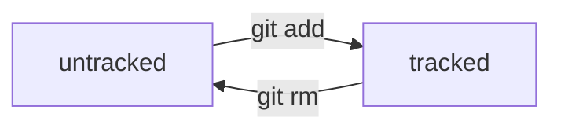
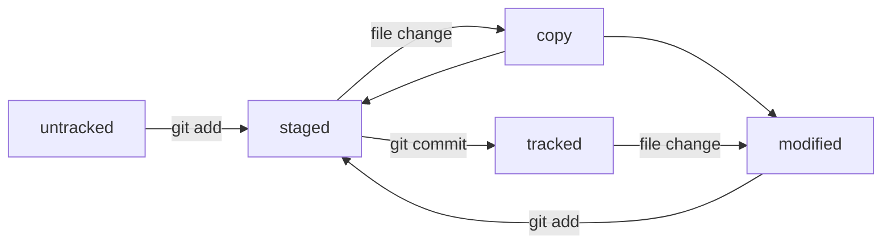

# Краткий Чит-Шит по работе с git и github

### Различие между git и github
**git** - опенсорс проект для контроля версий проектов
**github** - проект компании microsoft, предоставляюший услуги для удаленного и совместного использования репозиториев

### Гайд как создать и загрузить проект на github

### Создание локально
```
mkdir first-project
cd first-project
git init
```

### Добавление файлов для отслеживания
```
nano readme.md
git add readme.md
```

### Проверка статуса
```
git status
```
Убеждаемся, что отображаются совершенные изменения

### Создание коммита
```
git commit -m "Добавлен файл readme.md"
```

### Подключение к github через ssh
```
ssh-keygen -t ed25519 -C "<email>"
cat ~/.ssh/id_ed25519.pub
```
копируем ключ и привязываем к github в соответствующем разделе настроек. проверяем, что удалось подключится, проверяем ключи подлиности от github

```
ssh -T git@github.com
```

### Привязываем удаленный репозиторий к локальному
```
git remote add origin <url ssh>
```
проверяем, что добавилось
```
git remote -v
```

### Отправляем коммит на удаленный сервер
в первый раз:
```
git push -u origin master
```
в последующие разы убираем флаг `-u`

## Хэш, лог и HEAD
### Хэш коммита
Уникальный(практически всегда) идентификатор коммита. Получается из данных коммита и служит некоторой цифровой подписью

### git log
Комманда, выводящая на экран историю коммитов, включая их хэш и комментарий.

`----oneline` - флаг позволяет вывести краткую историю коммитов

### HEAD
Служебный файл, хранящий ссылку на хеш последнего коммита. Можно использовать вместо хеша при запросах к коммандной строке

## Жизненный цикл файлов
### Схема 1

### Схема 2


### Изменение последнего коммита
```
git commit --amend --no-edit
```
Флаг `--no-edit` означает сохранение имени коммита, иначе можно указать имя стандартным способом

### Откат изменений
### Удаление файла из staging area
`git restore --staged <file>```
### Откат изменений ненужного файла
`git restore <file>```
### ОПАСНО! Назначение HEAD коммита и удаление всех более поздних
`git reset --hard <commit hash>`

### Просмотр изменений
для файлов в статусе modified:
```
git diff
```
для файлов в статусе staged:
```
git diff --staged
```
**Варианты указания ссылок на коммиты
1. Сокращенные хеши коммитов
2. HEAD - последний коммит в текущей ветке
3. Название ветки - последний коммит в ней
4. Суффикс навигации `~` - возвращает более ранние коммиты. Например `git diff HEAD~2 master`
для просмотра изменений между коммитами указываем хеши этих коммитов


### .gitignore
`file?.txt` - подставляет любой один символ
`*.md` - любое количество символов
`**.tex` - любая файловая иерархия файлов
`file[a-z].txt` - любой один симовл из диапозона
`/todo.txt` - любой файл в корневой папке
`build/` - папку
`!doge.jpeg` - только не ge.jpeg

# Основы работы с ветками в Git
### Клонирование репозиториев
`git clone <address>`
Команда автоматически связывает локальный репозиторий с удаленный
При клонировании удаленного репозитария клонируется только текущая ветка.

### Форк
Операция в github, позволяющая создать копию репозитория для себя. Он не будет автоматически синхронизироваться с основным проектом.

### Работа с ветками (Branches)
Разные ветки в одном проекте существуют независимо. Изменения в одной не влияют на изменения в другой.
Ветка указывает на коммит, который сделан в ней последним. При этом две ветки могут ссылаться на один и тот же коммит — например, если вы только что создали ветку, но ещё не успели внести в неё коммит.

### Просмотр списка веток
`git branch`
Звездочкой обозначается текущая ветка
Чтобы увидеть в том числе ветки на удаленном сервере нужно добавить флаг `-a`

### Создание веток
У веток нет четкой иерархии
`git branch <name>`
Чтобы добавить ветку у проекта с удаленного сервера:
```git branch <branch-name> origin/<branch-name>```

### Правила наименования веток
1. Индивидуальны
2. `feature/<name>` - добавление новой функциональности
3. `bugfix/<nane>` - исправление ошибок 

### Переход в ветку
`git checkout <name>`
Если указать флаг `-b` то ветка сразу и создается
